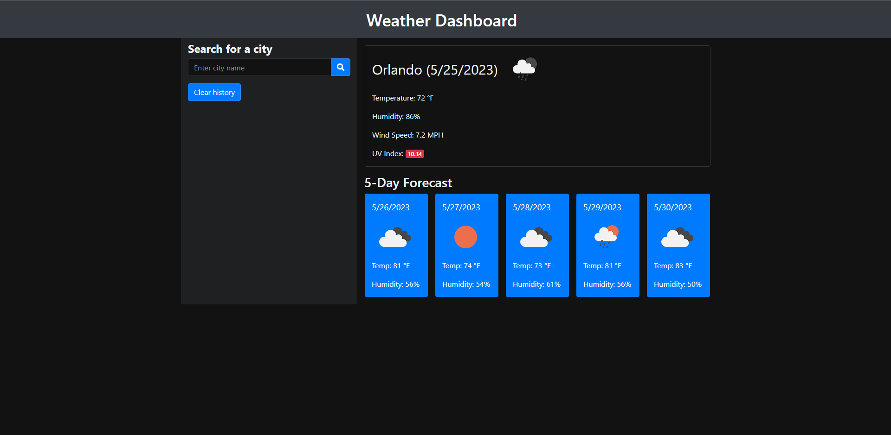

# Weather-Dashboard-App

## Description

This is a weather dashboard application that allows you to search for a city and view both current and future weather conditions for that city. The application also keeps track of your search history and allows you to easily access the weather information for previously searched cities.

 https://tbone2311.github.io/-Weather-Dashboard-App/

## Installation

In order to get the development enviorment running you will need to clone the repository from my git hub[https://github.com/tbone2311]

## Usage

To use the weather dashboard application, follow these steps:

Open the application in your preferred web browser.
Enter the name of a city in the search input field and click the search button or press Enter.
The current weather conditions for the city will be displayed, including the city name, date, weather condition icon, temperature, humidity, and wind speed.
Below the current weather, you will find the 5-day forecast for the city. Each day will show the date, weather condition icon, temperature, wind speed, and humidity.
The searched city will be added to the search history, allowing you to click on a city in the search history to view its current and future weather conditions again.

   

## Credits

https://developer.mozilla.org/en-US/docs/Web/JavaScript/Reference/Global_Objects/Date

## License

This weather dashboard application is licensed under the MIT License.